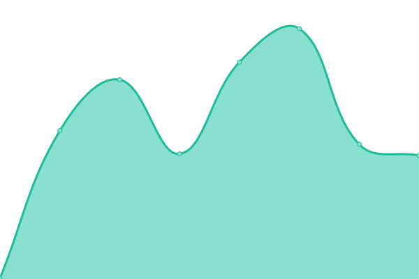
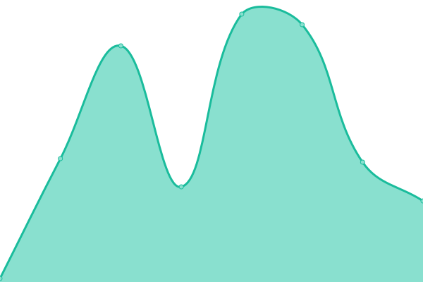

# [📈 Live Status](https://ccmbioinfo.github.io/status-genomics4rd): <!--live status--> **🟩 All systems operational**

This repository contains the open-source uptime monitor and status page for [Centre for Computational Medicine at SickKids](https://ccm.sickkids.ca), powered by [Upptime](https://github.com/upptime/upptime).

With [Upptime](https://upptime.js.org), you can get your own unlimited and free uptime monitor and status page, powered entirely by a GitHub repository. We use [Issues](https://github.com/ccmbioinfo/status-genomics4rd/issues) as incident reports, [Actions](https://github.com/ccmbioinfo/status-genomics4rd/actions) as uptime monitors, and [Pages](https://ccmbioinfo.github.io/status-genomics4rd) for the status page.

<!--start: status pages-->
<!-- This summary is generated by Upptime (https://github.com/upptime/upptime) -->
<!-- Do not edit this manually, your changes will be overwritten -->
<!-- prettier-ignore -->
| URL | Status | History | Response Time | Uptime |
| --- | ------ | ------- | ------------- | ------ |
|  [Stager (frontend)](https://stager.genomics4rd.ca) | 🟩 Up | [stager-frontend.yml](https://github.com/ccmbioinfo/status-genomics4rd/commits/HEAD/history/stager-frontend.yml) | 

 198ms
     
 | 

<a href="https://status.genomics4rd.ca/history/stager-frontend">97.22%</a>
    

|  [Stager (backend)](https://stager.genomics4rd.ca/api) | 🟩 Up | [stager-backend.yml](https://github.com/ccmbioinfo/status-genomics4rd/commits/HEAD/history/stager-backend.yml) | 

 37ms
     
 | 

<a href="https://status.genomics4rd.ca/history/stager-backend">100.00%</a>
    

|  [MinIO](http://minio.genomics4rd.ca/minio/health/live) | 🟩 Up | [min-io.yml](https://github.com/ccmbioinfo/status-genomics4rd/commits/HEAD/history/min-io.yml) | 

 292ms
     
 | 

<a href="https://status.genomics4rd.ca/history/min-io">100.00%</a>
    

<!--end: status pages-->

[**Visit our status website →**](https://ccmbioinfo.github.io/status-genomics4rd)

## 📄 License

- Powered by: [Upptime](https://github.com/upptime/upptime)
- Code: [MIT](./LICENSE) © [Centre for Computational Medicine at SickKids](https://ccm.sickkids.ca)
- Data in the `./history` directory: [Open Database License](https://opendatacommons.org/licenses/odbl/1-0/)
